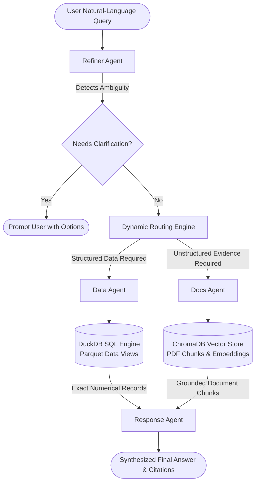

# Telemachus: Energy Intelligence RAG & Analytics Multi-Agent System

<p align="center">
  <strong>Deterministic energy time-series analytics meets semantic document retrieval.</strong>
</p>

<p align="center">
  
  
  
  
  
  
</p>

---

## 📖 Overview

**Telemachus** is a specialized multi-agent AI system designed to answer complex natural-language queries over **smart meter energy-consumption datasets** (millions of rows of structured time-series data) and **unstructured energy policy/technical documents** (PDFs, reports, and whitepapers).

Unlike standard RAG pipelines that struggle with large-scale tabular calculations, Telemachus strictly adheres to the core architectural tenet: **"The LLM interprets; DuckDB calculates."** Numerical calculations are never delegated to LLM hallucination—they are translated into analytical SQL executed deterministically over Parquet files with DuckDB, while unstructured contextual evidence is fetched via vector similarity search using ChromaDB.

The system includes a dedicated chat interface called **Lumen**, providing users with an intuitive, interactive assistant for clean energy, household consumption analysis, and sustainability insights.

---

## 🌟 Key Features

- **Multi-Agent Orchestration**: Modular agent pipeline separating query understanding, document retrieval, deterministic SQL analytics, and response synthesis.
- **Ambiguity Detection & Resolution**: Clarifies vague terms (e.g., *"unusually high consumption"*) by translating them into measurable statistical criteria (e.g., $\mu + 2\sigma$) or actively prompting the user for clarification.
- **Deterministic SQL Analytics with DuckDB**: Queries multi-gigabyte Parquet datasets directly without costly data loading, computing exact aggregations, baselines, and distributions.
- **Semantic Document RAG**: Document parsing, chunking, and cosine-similarity retrieval over energy whitepapers and reports using Google Generative AI Embeddings (`models/embedding-004`) and ChromaDB.
- **Strict Grounding & Citation**: Eliminates hallucinations by forcing the synthesis engine to cite verified database outputs and document source excerpts with page numbers.
- **Dynamic Query Routing**: Automatically detects whether a question requires structured data analytics, document retrieval, or a hybrid of both.
- **Lumen Interactive UI**: Modern, accessible frontend interface with conversational history, suggested prompt chips, source inspector drawers, and responsive design.

---

## 🏗️ Architecture & Workflow

### Multi-Agent Pipeline



### Agent Responsibilities

| Agent | Responsibility | Core Technology |
|---|---|---|
| **Refiner Agent** | Parses user intent, detects ambiguous parameters, defines technical metrics, and generates execution plans for downstream agents. | `google-genai` (Gemma / Gemini), Pydantic v2 |
| **Docs Agent** | Indexes and retrieves semantic chunks from PDF documents; returns grounded sources with page numbers and relevance scores. | LangChain, Google Embeddings, ChromaDB |
| **Data Agent** | Translates structured query plans into DuckDB SQL; queries Parquet files directly; enforces dataset constraints (e.g. 2011–2014 timeframe). | DuckDB, Pandas, Google GenAI |
| **Response Agent** | Synthesizes verified data results and retrieved document excerpts into a clear, cited natural-language response. | Google GenAI |
| **Orchestrator** | Coordinates agent lifecycle, manages dependency injection, and serves the REST API. | FastAPI, Uvicorn |

---

## 📊 Dataset & Schema

The structured dataset represents smart meter readings alongside weather and household demographic classifications:

- **Key Granularities**:
  - `DAILY`: Aggregated daily consumption summaries per household (`energy_mean`, `energy_median`, `energy_max`, `energy_min`, `energy_std`, `energy_sum`, `energy_count`).
  - `HHBLOCK`: Half-hourly block readings (`hh_0` through `hh_47`) for each day.
  - `HALFHOURLY`: Raw timestamped half-hourly consumption readings (`energy_kwh_hh`).
- **Demographics & Metadata**:
  - `LCLid`: Unique household identifier.
  - `stdorToU`: Tariff type (Standard or Time of Use).
  - `Acorn` / `Acorn_grouped`: ACORN socio-economic classification.
- **Weather Metrics**:
  - Daily temperatures (`temperatureMax`, `temperatureMin`), humidity, cloud cover, wind speed, UV index, and weather summaries.

---

## 📁 Repository Structure

```text
Telemachus/
├── backend/
│   ├── agents/
│   │   ├── __init__.py
│   │   ├── data_agent.py      # Translates plans into DuckDB SQL & executes queries
│   │   ├── refiner.py         # Intent refinement, ambiguity detection & routing
│   │   ├── response.py        # Final synthesis with citations and limitations
│   │   └── utils.py           # JSON cleanup and response sanitization utilities
│   ├── dataset/
│   │   ├── docs/              # Target folder for PDF documents and whitepapers
│   │   └── parquet/           # Target folder for structured energy Parquet files
│   ├── config.py              # Configuration loader, paths, and environment settings
│   ├── database.py            # DuckDB connection manager & view initializer
│   ├── inputpdf.py            # PDF ingestion, chunking, embedding, and Docs Agent
│   ├── llm.py                 # Google GenAI client initialization
│   ├── orchestrator.py        # Orchestration pipeline and FastAPI REST API
│   └── requirements.txt       # Python dependencies
├── db/
│   └── chroma_db_gemini/      # Persisted ChromaDB vector embeddings
├── documentation/
│   ├── architechture.md       # Architectural specification and design rationale
│   ├── prd.md                 # Product requirements document
│   └── prompts.md             # Complete system prompt definitions for agents
├── frontend/
│   └── index.html             # Lumen UI: modern interactive energy AI assistant
├── .env.example               # Example environment variable template
├── .gitignore                 # Git ignore rules for datasets, databases, and venv
└── README.MD                  # Project documentation
```

---

## 🚀 Getting Started

### 1. Prerequisites

- **Python 3.10+** installed
- **Google AI Studio API Key** (for Gemini / Gemma LLMs and Embedding models)

### 2. Clone the Repository

```bash
git clone https://github.com/ParthGhumade/Telemachus.git
cd Telemachus
```

### 3. Set Up Virtual Environment

```bash
python3 -m venv .venv
source .venv/bin/activate  # On Windows: .venv\Scripts\activate
```

### 4. Install Dependencies

```bash
pip install -r backend/requirements.txt
```

### 5. Configure Environment Variables

Copy `.env.example` to create your `.env` file:

```bash
cp .env.example .env
```

Edit `.env` and provide your Google API key:

```ini
# Google Gemini / GenAI API Key (Required)
gemini_api_key=your_google_api_key_here

# LLM & Embedding Model Settings
LLM_MODEL=gemini-3.5-flash
EMBEDDING_MODEL=models/gemini-embedding-001

# Google Drive Dataset Auto-Download (used in Docker Compose)
# DATASET_DRIVE_URL=https://drive.google.com/file/d/YOUR_FILE_ID/view?usp=sharing
# DATASET_DRIVE_ID=YOUR_FILE_ID
```

---

## 🐳 Docker Compose Quickstart (Recommended)

The entire Telemachus system is fully containerized. Running Docker Compose automatically downloads/unzips the dataset archive (`dataset.zip`), sets up DuckDB, indexes the text documents into ChromaDB, launches the web application, and **automatically spins up a Cloudflare Tunnel for public access**:

```bash
# 1. Provide your Gemini API key in .env
cp .env.example .env
# Edit .env with your gemini_api_key

# 2. Build and launch the container
docker compose up -d

# 3. View the live public Cloudflare Tunnel URL
docker compose logs -f
```

Every time the container starts, it outputs a banner with your temporary public URL:
```text
==================================================================
 🚀 TELEMACHUS PUBLIC CLOUDFLARE TUNNEL URL:
    https://<random-id>.trycloudflare.com

 📱 Open the URL above in your browser to access the live app!
 🏠 Local URL:     http://localhost:8000
 📚 API Docs:      http://localhost:8000/docs
==================================================================
```

---

## 🛠️ Data Ingestion & Local Setup

### Ingesting Unstructured Text Documents (RAG)

Place your energy whitepapers or reference documents as `.txt` files into `backend/dataset/docs/`, then run:

```bash
python backend/inputpdf.py --ingest
```

This will:
1. Load all `.txt` documents from the target directory.
2. Split documents into character chunks with overlap.
3. Generate 3072-dimensional vector embeddings using `models/gemini-embedding-001`.
4. Save the vector index into ChromaDB at `db/chroma_db_gemini`.

### Initializing the DuckDB Analytics Engine

Place your energy data Parquet files into `backend/dataset/parquet/`, then run:

```bash
python backend/database.py
```

This registers 7 views in DuckDB (`energy_data`, `hhblock_energy`, `households`, `weather_daily`, `weather_hourly`, `acorn_details`, `uk_bank_holidays`) reading all Parquet files directly.

---

## ⚡ Running Locally

### Launch the Backend API & Web UI

Start the FastAPI server via Uvicorn:

```bash
python backend/main.py
```

```bash
uvicorn backend.main:app --host 0.0.0.0 --port 8000 --reload
```

The API will be available at `http://localhost:8000`, with interactive Swagger docs at `http://localhost:8000/docs`.

### 2. Querying via API

Execute a POST request to `/api/query`:

```bash
curl -X POST http://localhost:8000/api/query \
     -H "Content-Type: application/json" \
     -d '{"query": "Which household had the highest average daily consumption in January 2013?"}'
```

**Example JSON Response:**

```json
{
  "response": "Based on the smart meter records, household **MAC000128** recorded the highest average daily consumption in January 2013 at **34.28 kWh/day**.\n\n### Findings:\n- Household ID: `MAC000128`\n- Period: 2013-01-01 to 2013-01-31\n- Metric: Mean daily consumption\n\n*Source: DuckDB analytical query over `energy_data` view.*"
}
```

### 3. Launching the Lumen Frontend

Open `frontend/index.html` directly in your browser, or serve it using any static file server:

```bash
cd frontend
python3 -m http.server 3000
```

Visit `http://localhost:3000` to interact with Lumen.

---

## 🛡️ Design Principles & Guardrails

1. **The LLM Interprets; DuckDB Calculates**: The language model generates the SQL query plan; DuckDB deterministically computes the metrics. The LLM never hallucinates aggregations or numbers.
2. **Ambiguity Exposure**: When user requests rely on subjective criteria (*"unusual"*, *"efficient"*, *"high"*), the Refiner Agent explicitly marks assumptions or requests clarification before running expensive computations.
3. **Timeline Awareness**: The smart meter dataset covers historical readings from 2011 to 2014. Queries requesting current or future periods receive explicit timeline acknowledgements.
4. **Citation Integrity**: Citations and page references are provided only if delivered directly by the vector retrieval engine.

---

## 📜 License

This project is licensed under the MIT License. See [LICENSE](LICENSE) for details.